<div align="center">

<!-- ═══════════════════════════ HERO BANNER (original SVG, glass + 3D depth baked in) ═══════════════════════════ -->


<!-- ═══════════════════════════ TYPING SVG ═══════════════════════════ -->
<a href="https://github.com/AmritaMalik">
  
</a>

<br/>


<br/><br/>

<a href="#-about-me">About</a> •
<a href="#️-tech-arsenal">Tech Stack</a> •
<a href="#-featured-projects">Projects</a> •
<a href="#-github-analytics">Stats</a> •
<a href="#-contribution-snake">Snake</a> •
<a href="#️-github-trophies">Trophies</a> •
<a href="#-current-goals">Goals</a>

</div>


<!-- ═══════════════════════════ PROFILE + SOCIALS ═══════════════════════════ -->
<table align="center">
<tr>
<td width="38%" align="center">


</td>
<td width="62%">

```python
class AmritaMalik:
    def __init__(self):
        self.name        = "Amrita Malik"
        self.role        = ["AI Engineer", "Full Stack Developer",
                             "Computer Vision Enthusiast", "Cloud Learner"]
        self.education   = "B.Tech CSE @ PIET, Panipat — 2nd Year"
        self.focus       = "Accessible AI • Computer Vision • Cloud"
        self.currently   = "Building SignBridge AI 🕶️"
        self.location    = "Panipat, Haryana, India 🇮🇳"

    def say_hi(self):
        print("Let's build something impactful together 🚀")
```

<div align="center">

[](https://github.com/AmritaMalik)
[](https://linkedin.com/in/amrita-malik-2007am)
[](https://amrita-malik-portfolio.vercel.app/)
[](mailto:codewithamrita@gmail.com)

</div>

</td>
</tr>
</table>


<!-- ═══════════════════════════ ABOUT ═══════════════════════════ -->
##  About Me

<table>
<tr>
<td width="50%" valign="top">

### 🎯 Current Focus
- 🕶️ Building **SignBridge AI** — AI smart glasses that translate Indian Sign Language in real time
- ☁️ Leveling up on **Google Cloud** & cloud-native ML deployment
- 🧠 Deepening **Deep Learning** & **System Design** fundamentals

### 🌱 Interests
- Computer Vision for accessibility & assistive tech
- Embedded AI on edge devices
- Open-source developer tooling

</td>
<td width="50%" valign="top">

### 🚀 Mission
> Build AI that removes barriers instead of creating them — technology should meet people where they are.

### ⚡ Quick Facts
- 🎓 2nd Year, B.Tech CSE, PIET
- 🇮🇳 Based in Panipat, Haryana
- 🏆 Aspiring Smart India Hackathon winner
- ☁️ Google Cloud learner-in-progress

</td>
</tr>
</table>

<div align="center">

| 🎯 Goal | 🎉 Fun Fact |
|---|---|
| Ship production-grade accessible AI | Debugs faster with lo-fi beats on 🎧 |
| Contribute to real open-source repos | Thinks in `git commit` messages |
| Crack a Software Engineering internship | Once trained a model *and* pulled an all-nighter for a hackathon in the same week |

</div>


<!-- ═══════════════════════════ TECH STACK ═══════════════════════════ -->
##  Tech Arsenal

<table width="100%">
<tr><td width="22%"><b>Languages</b></td><td></td></tr>
<tr><td><b>Frontend</b></td><td></td></tr>
<tr><td><b>AI / Computer Vision</b></td><td>


</td></tr>
<tr><td><b>Cloud</b></td><td></td></tr>
<tr><td><b>Tools</b></td><td></td></tr>
</table>

<sub>Stack kept exactly as you had it — nothing added or removed. Tell me if any of these should come off, or if there's something missing.</sub>


<!-- ═══════════════════════════ FEATURED PROJECTS ═══════════════════════════ -->
##  Featured Projects

<table width="100%">
<tr>
<td width="50%" valign="top">


### 🕶️ SignBridge AI
**AI smart glasses for Indian Sign Language → Speech**

Real-time computer-vision pipeline that recognizes Indian Sign Language gestures and converts them to speech and text, running on embedded hardware for genuine accessibility impact.

`Python` `TensorFlow` `MediaPipe` `OpenCV` `Embedded AI`


[](https://github.com/AmritaMalik/SignBridge-AI)

</td>
<td width="50%" valign="top">


### 🌐 Portfolio Website
**Personal developer portfolio**

A responsive, modern portfolio showcasing projects, skills, and experience — deployed on Vercel.

`React` `JavaScript` `HTML` `CSS`


[](https://amrita-malik-portfolio.vercel.app/)

</td>
</tr>
<tr>
<td width="50%" valign="top">


### ☁️ AWS Student Community Day Haryana
**Event website for AWS Student Community Day**

Built the official web presence for a regional AWS community event — covering schedule, speakers, and registration.

`HTML` `CSS` `JavaScript`


</td>
<td width="50%" valign="top">


### 🧮 Student Grade Calculator
**Lightweight academic utility tool**

A clean utility application that calculates grades/GPA — built to sharpen core logic and UI fundamentals.

`Python` `JavaScript`


</td>
</tr>
</table>

<sub>🔗 Repo links point to <code>github.com/AmritaMalik/&lt;repo-name&gt;</code> — update any that don't match your actual repo names yet.</sub>


<!-- ═══════════════════════════ GITHUB STATS ═══════════════════════════ -->
##  GitHub Analytics

<div align="center">


<br/>


<br/>


</div>

<details>
<summary><b>📈 Full metrics dashboard</b> (languages, habits, community — generated daily by <code>metrics.yml</code>)</summary>
<br/>
<div align="center">


</div>
</details>


<!-- ═══════════════════════════ SNAKE ═══════════════════════════ -->
##  Contribution Snake

<div align="center">

<picture>
  <source media="(prefers-color-scheme: dark)" srcset="https://raw.githubusercontent.com/AmritaMalik/AmritaMalik/output/github-contribution-grid-snake-dark.svg">
  
</picture>

<sub>Generated automatically by <code>.github/workflows/snake.yml</code> — see Setup Notes below.</sub>

</div>


<!-- ═══════════════════════════ TROPHIES ═══════════════════════════ -->
##  GitHub Trophies

<div align="center">


</div>


<!-- ═══════════════════════════ ACHIEVEMENTS ═══════════════════════════ -->
##  Achievements & Roadmap

<table width="100%">
<tr><td width="20%" align="center"><b>☁️ Cloud</b></td><td>Actively pursuing the <b>Google Cloud</b> learning track toward certification</td></tr>
<tr><td align="center"><b>🧑‍💻 Open Source</b></td><td>Building toward first meaningful contributions to accessibility-focused OSS repos</td></tr>
<tr><td align="center"><b>🏆 Hackathons</b></td><td>Targeting <b>Smart India Hackathon</b> with SignBridge AI as the flagship submission</td></tr>
<tr><td align="center"><b>📚 Learning</b></td><td>Deepening React, Node.js, Deep Learning, Data Structures & System Design</td></tr>
<tr><td align="center"><b>🎓 Certifications</b></td><td>Google Cloud certification — in progress</td></tr>
</table>

### 🗺️ Roadmap

```mermaid
graph LR
    A[Now: SignBridge AI v1] --> B[Strengthen DSA & System Design]
    B --> C[Google Cloud Certification]
    C --> D[Smart India Hackathon]
    D --> E[First Open-Source Contributions]
    E --> F[Software Engineering Internship]
    F --> G[Deepen Deep Learning & MLOps]

    style A fill:#0F0C29,stroke:#39FF14,color:#39FF14
    style B fill:#0F0C29,stroke:#9D4EDD,color:#B79CED
    style C fill:#0F0C29,stroke:#9D4EDD,color:#B79CED
    style D fill:#0F0C29,stroke:#00B4D8,color:#00B4D8
    style E fill:#0F0C29,stroke:#00B4D8,color:#00B4D8
    style F fill:#0F0C29,stroke:#39FF14,color:#39FF14
    style G fill:#0F0C29,stroke:#39FF14,color:#39FF14
```



<sub>Update the milestone labels each quarter so the roadmap doesn't go stale.</sub>


<!-- ═══════════════════════════ GOALS ═══════════════════════════ -->
##  Current Goals

- [ ] 🤖 Build impactful AI applications
- [ ] 🌍 Contribute to Open Source
- [ ] ☁️ Google Cloud Certification
- [ ] 🏆 Win Smart India Hackathon
- [ ] 💼 Land a Software Engineering Internship


<!-- ═══════════════════════════ QUOTE ═══════════════════════════ -->
<div align="center">

## 💬 Developer Quote


<sub>— Amrita Malik</sub>

</div>

<!-- ═══════════════════════════ VISITOR COUNTER ═══════════════════════════ -->
<div align="center">
<br/>


</div>

<!-- ═══════════════════════════ FOOTER ═══════════════════════════ -->


---

<details>
<summary><b>⚙️ Setup Notes (click to expand)</b></summary>

### 1. Repo requirements
This README is designed for a **profile repo**: a repo named exactly `AmritaMalik` (matching the username), with this file at its root as `README.md`.

### 2. Folder structure — case matters!
Every image path in this README uses **lowercase** `assets/...`. Your actual folder on GitHub must also be lowercase `assets` (not `Assets`) — GitHub's raw file links are case-sensitive, so a mismatch here is the single most common cause of a broken image. Final structure must look exactly like this:

```
AmritaMalik/
├── README.md
├── assets/
│   ├── banner.svg
│   ├── hero-illustration.svg
│   ├── divider.svg
│   ├── footer.svg
│   ├── chip.svg
│   ├── card-glow.svg
│   └── metrics.svg        ← generated automatically by metrics.yml, don't upload this one yourself
└── .github/
    └── workflows/
        ├── snake.yml
        └── metrics.yml
```

### 3. Workflow permissions
In **Settings → Actions → General → Workflow permissions**, select **"Read and write permissions"** and save. Both `snake.yml` and `metrics.yml` push commits back to the repo — without this, they fail with a 403.

### 4. Snake workflow
Generates the contribution snake on the `output` branch using `Platane/snk@v3` (current recommended tag) and pushes it with `crazy-max/ghaction-github-pages@v5` (updated from v4 — v5 is the current maintained release, requires GitHub's Node 24 runner which all standard `ubuntu-latest` runners already have).

### 5. Metrics workflow
Runs [lowlighter/metrics](https://github.com/lowlighter/metrics) and commits `assets/metrics.svg` directly — this is the officially documented `@latest` usage pattern, still current. It replaces the need for several separate stat widgets with one configurable dashboard.

### 6. Stats services
`github-readme-stats`, `github-readme-streak-stats`, `github-profile-trophy`, and `github-readme-activity-graph` are free hosted services. If one shows "rate limited," that's the shared public instance under load — it recovers on its own, or you can self-host any of them for reliability.

### 7. Why there's no live "hover-tilt" glass effect
GitHub sanitizes README HTML and strips `<style>`/`<script>` tags, so true CSS-driven hover/tilt/perspective animations (the kind a real website can do) cannot run on a profile page — this is a GitHub platform limit, not a design shortcut. The glass/3D depth you see (soft shadows, layered translucent panels, glowing borders) is baked directly into the SVGs themselves using SVG filters, which is the actual technique top GitHub profiles use to achieve this look within Markdown's constraints.

</details>


