<div align="center">

<!-- ═══════════════════════════ HERO BANNER (original SVG, glass + 3D depth baked in) ═══════════════════════════ -->


<!-- ═══════════════════════════ TYPING SVG ═══════════════════════════ -->
<a href="https://github.com/AmritaMalik">
  
</a>

<br/>


<br/><br/>

<a href="#-about-me">About</a> •
<a href="#️-tech-arsenal">Tech Stack</a> •
<a href="#-featured-projects">Projects</a> •
<a href="#-github-analytics">Stats</a> •
<a href="#-contribution-snake">Snake</a> •
<a href="#️-github-trophies">Trophies</a> •
<a href="#-current-goals">Goals</a>

</div>


<!-- ═══════════════════════════ PROFILE + SOCIALS ═══════════════════════════ -->
<table align="center">
<tr>
<td width="38%" align="center">


</td>
<td width="62%">

<pre><code>class AmritaMalik:
    def __init__(self):
        self.name        = "Amrita Malik"
        self.role        = ["B.Tech CSE Student", "AI &amp; Computer Vision Explorer",
                             "Cloud Learner", "Aspiring Full Stack Developer"]
        self.education   = "B.Tech CSE @ PIET, Panipat — 2nd Year"
        self.focus       = "Accessible AI • Computer Vision • Cloud"
        self.currently   = "Prototyping SignBridge AI 🕶️ (concept stage)"
        self.location    = "Panipat, Haryana, India 🇮🇳"

    def say_hi(self):
        print("Let's build something impactful together 🚀")
</code></pre>

<div align="center">

<a href="https://github.com/AmritaMalik"></a>
<a href="https://linkedin.com/in/amrita-malik-2007am"></a>
<a href="https://amrita-malik-portfolio.vercel.app/"></a>
<a href="mailto:codewithamrita@gmail.com"></a>

</div>

</td>
</tr>
</table>


<!-- ═══════════════════════════ ABOUT ═══════════════════════════ -->
##  About Me

<table>
<tr>
<td width="50%" valign="top">

<h3>🎯 Current Focus</h3>
<ul>
<li>🕶️ Prototyping <b>SignBridge AI</b> — a concept for AI smart glasses that translate Indian Sign Language in real time</li>
<li>☁️ Learning <b>Google Cloud</b> fundamentals via Google Cloud Skills Boost</li>
<li>🧠 Building foundations in <b>AI, Computer Vision &amp; Full Stack Development</b></li>
</ul>

<h3>🌱 Interests</h3>
<ul>
<li>Computer Vision for accessibility &amp; assistive tech</li>
<li>AI-assisted development workflows</li>
<li>Open-source developer tooling</li>
</ul>

</td>
<td width="50%" valign="top">

<h3>🚀 Mission</h3>
<blockquote>Build AI that removes barriers instead of creating them — technology should meet people where they are.</blockquote>

<h3>⚡ Quick Facts</h3>
<ul>
<li>🎓 2nd Year, B.Tech CSE, PIET</li>
<li>🇮🇳 Based in Panipat, Haryana</li>
<li>🏆 Aspiring Smart India Hackathon participant</li>
<li>☁️ Google Cloud learner-in-progress</li>
</ul>

</td>
</tr>
</table>

<div align="center">

<table>
<tr><th>🎯 Goal</th><th>🎉 Fun Fact</th></tr>
<tr><td>Learn to ship real, accessible AI projects</td><td>Debugs faster with lo-fi beats on 🎧</td></tr>
<tr><td>Make first open-source contributions</td><td>Thinks in <code>git commit</code> messages</td></tr>
<tr><td>Crack a Software Engineering internship</td><td>Pulled an all-nighter designing for a hackathon idea</td></tr>
</table>

</div>


<!-- ═══════════════════════════ TECH STACK ═══════════════════════════ -->
##  Tech Arsenal

<table width="100%">
<tr>
<td width="22%"><b>Languages</b></td>
<td></td>
</tr>
<tr>
<td><b>Dev Tools</b></td>
<td></td>
</tr>
<tr>
<td><b>AI Assistants</b></td>
<td>


</td>
</tr>
<tr>
<td><b>Design & Creative</b></td>
<td>


</td>
</tr>
<tr>
<td><b>Cloud</b></td>
<td>


</td>
</tr>
<tr>
<td><b>Currently Learning</b></td>
<td>


</td>
</tr>
</table>

<sub>Every skill above is one I actually use or am actively learning — nothing here is aspirational padding. The "Currently Learning" row is intentionally styled in a softer lavender to signal in-progress, not mastered.</sub>


<!-- ═══════════════════════════ FEATURED PROJECTS ═══════════════════════════ -->
##  Featured Projects

<table width="100%">
<tr>
<td width="50%" valign="top">


<h3>🕶️ SignBridge AI</h3>
<p><b>Concept: AI smart glasses for Indian Sign Language → Speech</b></p>
<p>An early-stage, concept-driven project exploring how a computer-vision pipeline could recognize Indian Sign Language gestures and convert them to speech and text — designed as a learning project to build real Computer Vision and AI skills toward a genuine accessibility tool.</p>
<p><code>Python</code> <code>Computer Vision (Learning)</code> <code>Accessibility Tech</code></p>
<p>


</p>
<p><a href="https://github.com/AmritaMalik/SignBridge-AI"></a></p>

</td>
<td width="50%" valign="top">


<h3>🌐 Portfolio Website</h3>
<p><b>Personal developer portfolio</b></p>
<p>A personal portfolio site showcasing projects, skills, and experience — built with the web fundamentals I'm actively strengthening, and deployed on Vercel.</p>
<p><code>HTML</code> <code>CSS</code> <code>JavaScript</code></p>
<p>


</p>
<p><a href="https://amrita-malik-portfolio.vercel.app/"></a></p>

</td>
</tr>
<tr>
<td width="50%" valign="top">


<h3>☁️ AWS Student Community Day Haryana</h3>
<p><b>Event website for AWS Student Community Day</b></p>
<p>Built the official web presence for a regional AWS community event — covering schedule, speakers, and registration.</p>
<p><code>HTML</code> <code>CSS</code> <code>JavaScript</code></p>
<p>


</p>

</td>
<td width="50%" valign="top">


<h3>🧮 Student Grade Calculator</h3>
<p><b>Lightweight academic utility tool</b></p>
<p>A clean utility application that calculates grades/GPA — built to sharpen core logic and UI fundamentals.</p>
<p><code>Python</code> <code>JavaScript</code></p>
<p>


</p>

</td>
</tr>
</table>

<sub>🔗 Repo links point to <code>github.com/AmritaMalik/&lt;repo-name&gt;</code> — update any that don't match your actual repo names yet.</sub>


<!-- ═══════════════════════════ GITHUB STATS ═══════════════════════════ -->
##  GitHub Analytics

<div align="center">


<br/>


<br/>


</div>

<details>
<summary><b>📈 Full metrics dashboard</b> (languages, habits, community — generated daily by <code>metrics.yml</code>)</summary>
<br/>
<div align="center">


</div>
</details>


<!-- ═══════════════════════════ SNAKE ═══════════════════════════ -->
##  Contribution Snake

<div align="center">

<picture>
  <source media="(prefers-color-scheme: dark)" srcset="https://raw.githubusercontent.com/AmritaMalik/AmritaMalik/output/github-contribution-grid-snake-dark.svg">
  
</picture>

<sub>Generated automatically by <code>.github/workflows/snake.yml</code> — see Setup Notes below if this looks broken.</sub>

</div>


<!-- ═══════════════════════════ TROPHIES ═══════════════════════════ -->
##  GitHub Trophies

<div align="center">


</div>


<!-- ═══════════════════════════ ACHIEVEMENTS ═══════════════════════════ -->
##  Achievements & Roadmap

<table width="100%">
<tr><td width="20%" align="center"><b>☁️ Cloud</b></td><td>Actively pursuing the <b>Google Cloud Skills Boost</b> learning track</td></tr>
<tr><td align="center"><b>🧑‍💻 Open Source</b></td><td>Building toward first meaningful contributions to accessibility-focused OSS repos</td></tr>
<tr><td align="center"><b>🏆 Hackathons</b></td><td>Targeting <b>Smart India Hackathon</b> with SignBridge AI as a concept submission</td></tr>
<tr><td align="center"><b>📚 Learning</b></td><td>Deepening CSS, JavaScript, AI, Computer Vision, Full Stack Development, and Data Structures & System Design</td></tr>
<tr><td align="center"><b>🎓 Certifications</b></td><td>Google Cloud Skills Boost — in progress</td></tr>
</table>

### 🗺️ Roadmap

```mermaid
graph LR
    A[Now: SignBridge AI Concept] --> B[Strengthen DSA & System Design]
    B --> C[Google Cloud Skills Boost Certification]
    C --> D[Smart India Hackathon]
    D --> E[First Open-Source Contributions]
    E --> F[Software Engineering Internship]
    F --> G[Deepen AI & Computer Vision Skills]

    style A fill:#0F0C29,stroke:#39FF14,color:#39FF14
    style B fill:#0F0C29,stroke:#9D4EDD,color:#B79CED
    style C fill:#0F0C29,stroke:#9D4EDD,color:#B79CED
    style D fill:#0F0C29,stroke:#00B4D8,color:#00B4D8
    style E fill:#0F0C29,stroke:#00B4D8,color:#00B4D8
    style F fill:#0F0C29,stroke:#39FF14,color:#39FF14
    style G fill:#0F0C29,stroke:#39FF14,color:#39FF14
```



<sub>Update the milestone labels each quarter so the roadmap doesn't go stale.</sub>


<!-- ═══════════════════════════ GOALS ═══════════════════════════ -->
##  Current Goals

- [ ] 🤖 Build a working Computer Vision prototype
- [ ] 🌍 Make first Open Source contribution
- [ ] ☁️ Finish Google Cloud Skills Boost track
- [ ] 🏆 Present at Smart India Hackathon
- [ ] 💼 Land a Software Engineering Internship


<!-- ═══════════════════════════ QUOTE ═══════════════════════════ -->
<div align="center">

## 💬 Developer Quote


<sub>— Amrita Malik</sub>

</div>

<!-- ═══════════════════════════ VISITOR COUNTER ═══════════════════════════ -->
<div align="center">
<br/>


</div>

<!-- ═══════════════════════════ FOOTER ═══════════════════════════ -->


---

<details>
<summary><b>⚙️ Setup Notes (click to expand)</b></summary>

### 1. Repo requirements
This README is designed for a **profile repo**: a repo named exactly `AmritaMalik` (matching the username), with this file at its root as `README.md`.

### 2. Folder structure — case matters!
Every image path in this README uses **lowercase** `assets/...`. Your actual folder on GitHub must also be lowercase `assets` (not `Assets`) — GitHub's raw file links are case-sensitive, so a mismatch here is the single most common cause of a broken image. Final structure must look exactly like this:

```
AmritaMalik/
├── README.md
├── assets/
│   ├── banner.svg
│   ├── hero-illustration.svg
│   ├── divider.svg
│   ├── footer.svg
│   ├── chip.svg
│   ├── card-glow.svg
│   └── metrics.svg        ← generated automatically by metrics.yml, don't upload this one yourself
└── .github/
    └── workflows/
        ├── snake.yml
        └── metrics.yml
```

### 3. Workflow permissions
In **Settings → Actions → General → Workflow permissions**, select **"Read and write permissions"** and save. Both `snake.yml` and `metrics.yml` push commits back to the repo — without this, they fail with a 403.

### 4. Snake workflow — why it may look broken right now
The snake image points at the `output` branch (`.../AmritaMalik/output/github-contribution-grid-snake.svg`), which **only exists after `snake.yml` has run at least once**. If you've just added this README, that branch doesn't exist yet, so the image 404s — this matches what shows up as a broken image in your screenshots. Fix: go to **Actions → snake → Run workflow** to trigger it manually the first time; after that it updates on its own schedule.

### 5. Metrics workflow
Runs [lowlighter/metrics](https://github.com/lowlighter/metrics) and commits `assets/metrics.svg` directly.

### 6. Stats services — why some cards were broken
- `github-readme-stats.vercel.app` (the public shared instance) has had repeated outages and rate-limit downtime; its own maintainers now point people to the actively-maintained fork, **GitHub Stats Extended** (`github-stats-extended.vercel.app`), which this README now uses for both the stats card and top languages card.
- `github-readme-streak-stats.herokuapp.com` is a dead link — Heroku shut down its free tier in November 2022, so any `.herokuapp.com` widget URL from an older template will never load. This README now uses the current official domain, `streak-stats.demolab.com`.
- `github-profile-trophy.vercel.app` and `github-readme-activity-graph.vercel.app` are free hosted services that can occasionally be rate-limited under load; this is usually temporary and clears on its own. Self-hosting either is the long-term fix if it keeps happening.

### 7. Repo links
The SignBridge AI repo link and the "repo names" note in Featured Projects are placeholders — swap in your actual repo URLs once they exist so the buttons don't 404.

### 8. Why there's no live "hover-tilt" glass effect
GitHub sanitizes README HTML and strips `<style>`/`<script>` tags, so true CSS-driven hover/tilt/perspective animations cannot run on a profile page — this is a GitHub platform limit, not a design shortcut. The glass/3D depth you see (soft shadows, layered translucent panels, glowing borders) is baked directly into the SVGs themselves using SVG filters.

</details>
