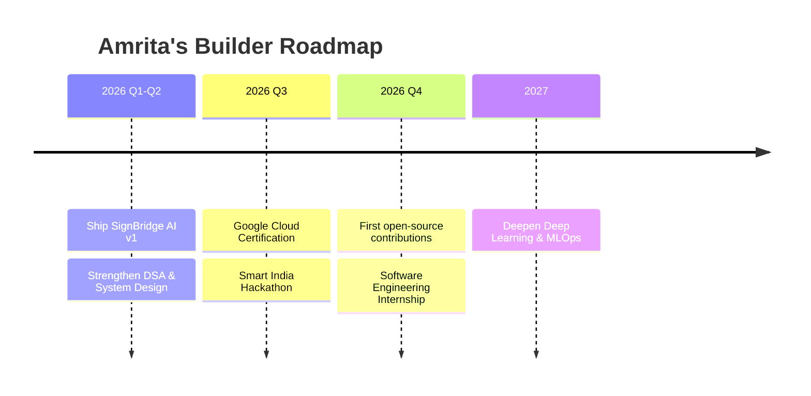

<div align="center">

<!-- ═══════════════════════════ HERO BANNER ═══════════════════════════ -->


<!-- ═══════════════════════════ TYPING SVG ═══════════════════════════ -->
<a href="https://github.com/AmritaMalik">
  
</a>

<br/>


</div>

<!-- ═══════════════════════════ DIVIDER ═══════════════════════════ -->


<br/>

<!-- ═══════════════════════════ PROFILE + SOCIALS ═══════════════════════════ -->
<table align="center">
<tr>
<td width="38%" align="center">


<sub><i>💡 Replace <code>assets/hero-illustration.svg</code> with a vector "female developer + hologram + laptop" illustration — see the <b>Setup Notes</b> section at the bottom for free professional-vector sources (Storyset / unDraw), since original artwork can't be shipped pre-made here.</i></sub>

</td>
<td width="62%">

```yaml
class AmritaMalik:
    def __init__(self):
        self.name        = "Amrita Malik"
        self.role        = ["AI Engineer", "Full Stack Developer",
                             "Computer Vision Enthusiast", "Cloud Learner"]
        self.education   = "B.Tech CSE (Hons.) @ PIET, Panipat — 2nd Year"
        self.focus       = "Accessible AI • Computer Vision • Cloud"
        self.currently   = "Building SignBridge AI 🕶️"
        self.location    = "Panipat, Haryana, India 🇮🇳"

    def say_hi(self):
        print("Let's build something impactful together 🚀")
```

<div align="center">

[](https://github.com/AmritaMalik)
[](https://linkedin.com/in/amrita-malik-2007am)
[](https://amrita-malik-portfolio.vercel.app/)
[](mailto:codewithamrita@gmail.com)

</div>

</td>
</tr>
</table>


<!-- ═══════════════════════════ ABOUT ME ═══════════════════════════ -->
## 🧬 About Me

<table>
<tr>
<td width="50%" valign="top">

### 🎯 Current Focus
- 🕶️ Building **SignBridge AI** — AI smart glasses that translate Indian Sign Language in real time
- ☁️ Leveling up on **Google Cloud** & cloud-native ML deployment
- 🧠 Deepening **Deep Learning** & **System Design** fundamentals

### 🌱 Interests
- Computer Vision for accessibility & assistive tech
- Embedded AI on edge devices
- Open-source developer tooling

</td>
<td width="50%" valign="top">

### 🚀 Mission
> Build AI that removes barriers instead of creating them — technology should meet people where they are.

### ⚡ Quick Facts
- 🎓 2nd Year, B.Tech CSE (Hons.), PIET
- 🇮🇳 Based in Panipat, Haryana
- 🏆 Aspiring Smart India Hackathon winner
- ☁️ Google Cloud learner-in-progress

</td>
</tr>
</table>

<div align="center">

| 🎯 Goal | 🎉 Fun Fact |
|---|---|
| Ship production-grade accessible AI | Debugs faster with lo-fi beats on 🎧 |
| Contribute to real open-source repos | Thinks in `git commit` messages |
| Crack a Software Engineering internship | Once trained a model *and* pulled an all-nighter for a hackathon in the same week |

</div>


<!-- ═══════════════════════════ TECH STACK ═══════════════════════════ -->
## 🛠️ Tech Arsenal

**Languages**
<br/>


**Frontend & Learning**
<br/>


**AI / Computer Vision**
<br/>


**Cloud**
<br/>


**Tools**
<br/>


<!-- ═══════════════════════════ FEATURED PROJECTS ═══════════════════════════ -->
## 💎 Featured Projects

<table width="100%">
<tr>
<td width="50%" valign="top">

### 🕶️ [SignBridge AI](https://github.com/AmritaMalik/SignBridge-AI)
**AI smart glasses for Indian Sign Language → Speech**

Real-time computer-vision pipeline that recognizes Indian Sign Language gestures and converts them to speech and text, running on embedded hardware for genuine accessibility impact.

`Python` `TensorFlow` `MediaPipe` `OpenCV` `Embedded AI`


</td>
<td width="50%" valign="top">

### 🌐 [Portfolio Website](https://amrita-malik-portfolio.vercel.app/)
**Personal developer portfolio**

A responsive, modern portfolio showcasing projects, skills, and experience — deployed on Vercel.

`React` `JavaScript` `HTML` `CSS`


</td>
</tr>
<tr>
<td width="50%" valign="top">

### ☁️ AWS Student Community Day Haryana
**Event website for AWS Student Community Day**

Built the official web presence for a regional AWS community event — covering schedule, speakers, and registration.

`HTML` `CSS` `JavaScript`


</td>
<td width="50%" valign="top">

### 🧮 Student Grade Calculator
**Lightweight academic utility tool**

A clean utility application that calculates grades/GPA — built to sharpen core logic and UI fundamentals.

`Python` / `JavaScript`


</td>
</tr>
</table>

<sub>🔗 Update each project heading link above to the exact repo URL once pushed — placeholders point to <code>github.com/AmritaMalik/&lt;repo-name&gt;</code>.</sub>


<!-- ═══════════════════════════ GITHUB STATS ═══════════════════════════ -->
## 📊 GitHub Analytics

<div align="center">


<br/>


<br/>


</div>


<!-- ═══════════════════════════ SNAKE ANIMATION ═══════════════════════════ -->
## 🐍 Contribution Snake

<div align="center">


<sub>Generated automatically by the <code>snake.yml</code> workflow below — see <b>Setup Notes</b> to activate it.</sub>

</div>


<!-- ═══════════════════════════ TROPHIES ═══════════════════════════ -->
## 🏆 GitHub Trophies

<div align="center">


</div>


<!-- ═══════════════════════════ ACHIEVEMENTS ═══════════════════════════ -->
## 🎖️ Achievements & Roadmap

<table width="100%">
<tr>
<td width="20%" align="center"><b>☁️ Cloud</b></td>
<td>Actively pursuing the <b>Google Cloud</b> learning track toward certification</td>
</tr>
<tr>
<td align="center"><b>🧑‍💻 Open Source</b></td>
<td>Building toward first meaningful contributions to accessibility-focused OSS repos</td>
</tr>
<tr>
<td align="center"><b>🏆 Hackathons</b></td>
<td>Targeting <b>Smart India Hackathon</b> with SignBridge AI as the flagship submission</td>
</tr>
<tr>
<td align="center"><b>📚 Learning</b></td>
<td>Deepening React, Node.js, Deep Learning, Data Structures & System Design</td>
</tr>
<tr>
<td align="center"><b>🎓 Certifications</b></td>
<td>Google Cloud certification — in progress</td>
</tr>
</table>

### 🗺️ Roadmap




<!-- ═══════════════════════════ CURRENT GOALS ═══════════════════════════ -->
## 🎯 Current Goals

- [ ] 🤖 Build impactful AI applications
- [ ] 🌍 Contribute to Open Source
- [ ] ☁️ Google Cloud Certification
- [ ] 🏆 Win Smart India Hackathon
- [ ] 💼 Land a Software Engineering Internship


<!-- ═══════════════════════════ QUOTE ═══════════════════════════ -->
<div align="center">

## 💬 Developer Quote


<sub>— Amrita Malik</sub>

</div>

<!-- ═══════════════════════════ VISITOR COUNTER ═══════════════════════════ -->
<div align="center">
<br/>


</div>

<!-- ═══════════════════════════ FOOTER ═══════════════════════════ -->


---

<details>
<summary><b>⚙️ Setup Notes (click to expand) — what to configure before this goes live</b></summary>

### 1. Repo requirements
This README is designed for a **profile repo**: create a repo named exactly `AmritaMalik` (matching the GitHub username) and put this file at its root as `README.md`.

### 2. Hero illustration
`assets/hero-illustration.svg` is referenced but not bundled here (no ready-made "professional vector, not anime/cartoon, female developer + hologram + laptop" asset exists as a public URL to link to). Two ways to get one:
- Download a free vector from **Storyset** (storyset.com, search "developer" / "artificial intelligence", recolor to purple/matrix-green) or **unDraw** (undraw.co) and save it as `assets/hero-illustration.svg` in this repo.
- Or commission/generate a custom illustration and drop it in the same path — the README will pick it up automatically since it points at your own repo's `assets/` folder.

### 3. Activate the Snake animation
Add the workflow file below at `.github/workflows/snake.yml`, then push once to `main` — GitHub Actions will generate the animated SVG on an `output` branch automatically (already wired into the README above).

### 4. Stats services
`github-readme-stats`, `github-readme-streak-stats`, `github-profile-trophy`, and `github-readme-activity-graph` are free hosted services — no setup needed beyond your username already being in the URLs (`AmritaMalik`). If any widget shows "rate limited," that's the public instance being busy; it recovers automatically, or you can self-host any of them.

### 5. Mermaid roadmap
GitHub renders `mermaid` code blocks natively — no extra setup required.

</details>
